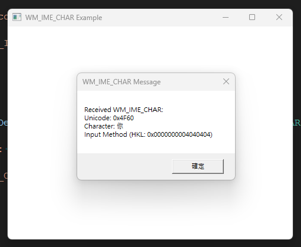

# IME Character Output Demo

This program demonstrates how to capture and display input characters using **WM_IME_CHAR** and **WM_CHAR** messages in a Windows application. It detects the input method (IME) currently in use and shows the received character along with its Unicode value.

